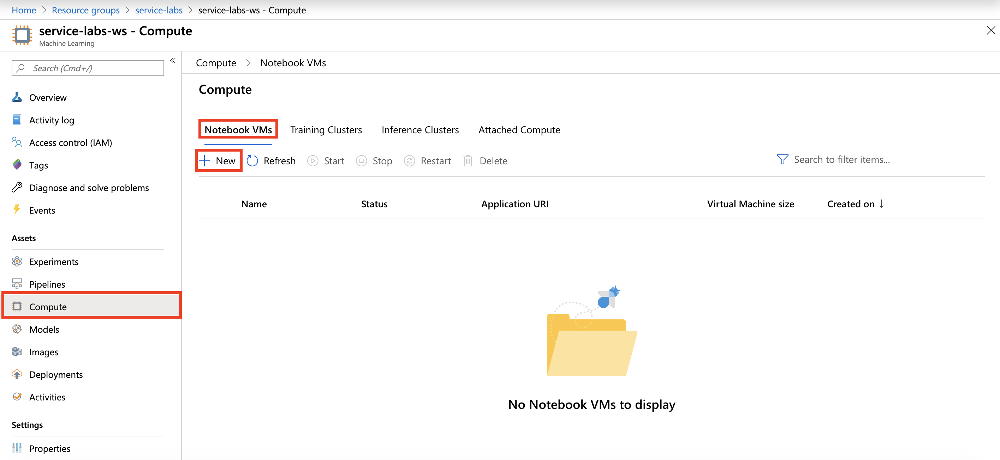
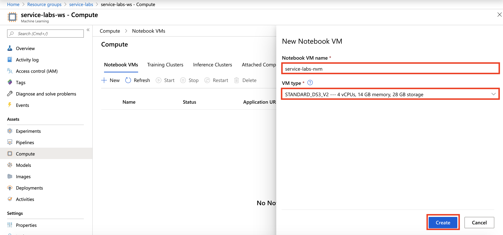
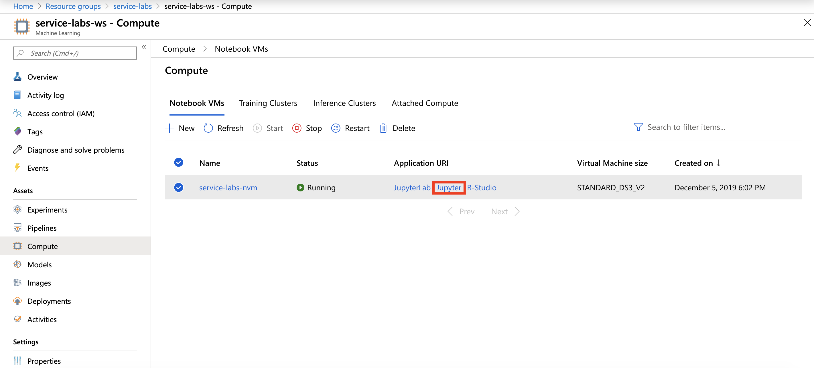
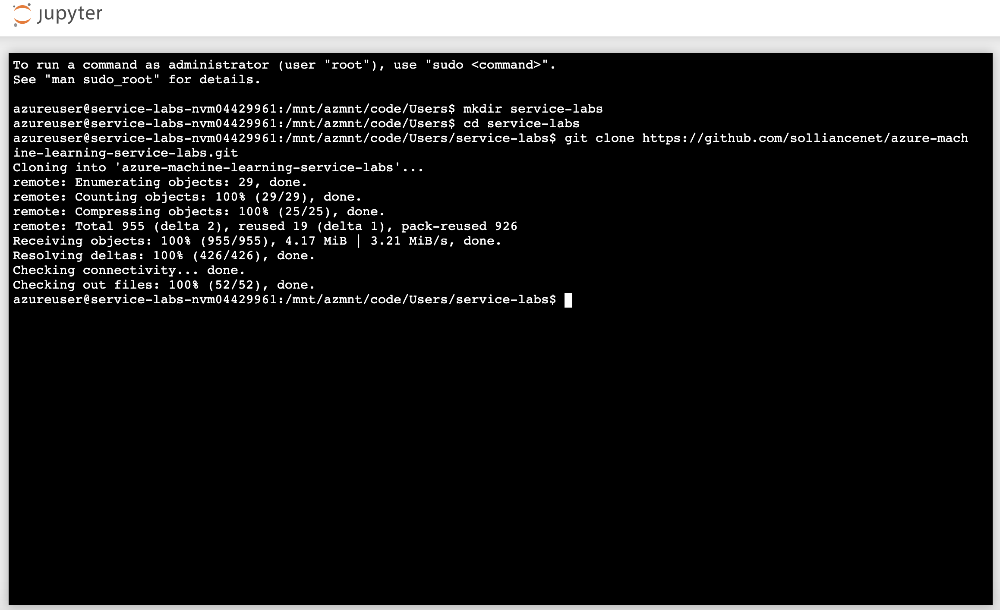
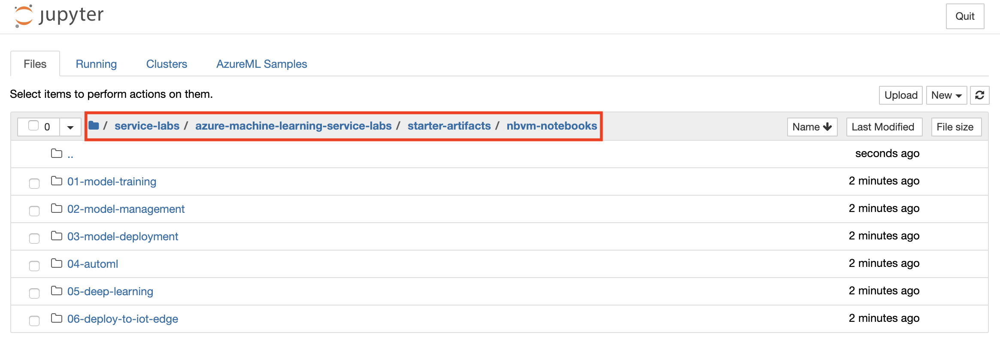

# Azure Notebook VMs Setup

At a high level, here are the setup tasks you will need to perform to prepare your Azure Notebook VM Environment (the detailed instructions follow):

1. Create a Notebook VM in your Azure subscription

2. Import the Lab Notebooks

3. Locate the Lab Notebooks

## Prerequisites

- If an environment is provided to you. Use the workspace named: `service-labs-ws-XXXXX`, where `XXXXX` is your unique identifier.

- If you are using your own Azure subscription. Create an Azure Machine Learning service workspace, **basic edition**, named: `service-labs-ws`. See [Create an Azure Machine Learning Service Workspace](https://docs.microsoft.com/en-us/azure/machine-learning/service/setup-create-workspace) for details on how to create the workspace.

## Task 1: Create a Notebook VM

1. Log into [Azure Portal](https://portal.azure.com/) and open the machine learning workspace: service-labs-ws-XXXXX or service-labs-ws

2. Select **Compute, Notebook VMs** in the left navigation and then select **+ New**

   

3. Provide Name: `service-labs-nvm` and VM type: `STANDARD_DS3_V2 --- 4 vCPUs, 14 GB memory, 28 GB storage` and then select **Create**

   
  
4. Wait for the VM to be ready, it will take around 5 minutes.

## Task 2: Import the Lab Notebooks

1. Select the Notebook VM: **service-labs-nvm** and then select **Jupyter** open icon, to open Jupyter Notebooks interface.

   

2. Select **New, Terminal** as shown to open the terminal page.

   
  
3. Run the following commands in order in the terminal window:

   a. `mkdir service-labs`
   
   b. `cd service-labs`
   
   c. `git clone https://github.com/solliancenet/azure-machine-learning-service-labs.git`
   
      
   
   d. Wait for the import to complete.

## Task 3: Locate the Lab Notebooks

1. From the Jupyter Notebooks interface, navigate to the `service-labs/azure-machine-learning-service-labs/starter-artifacts/nbvm-notebooks` folder where you will find all your lab files.

   
