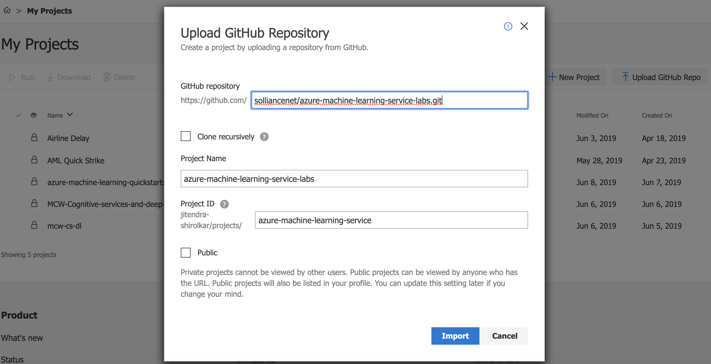
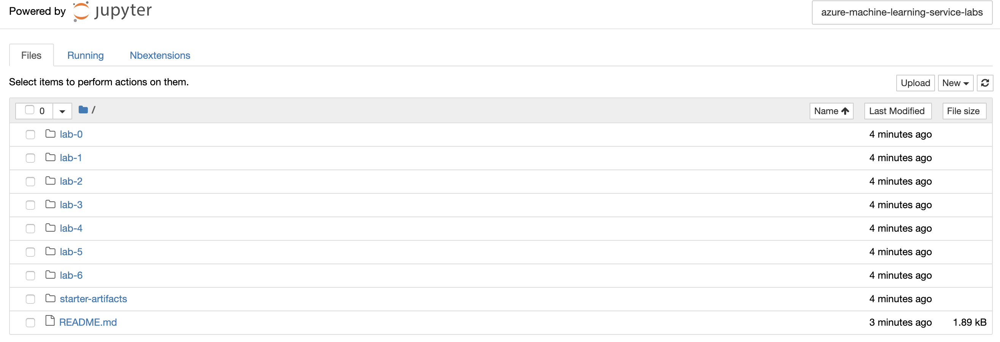
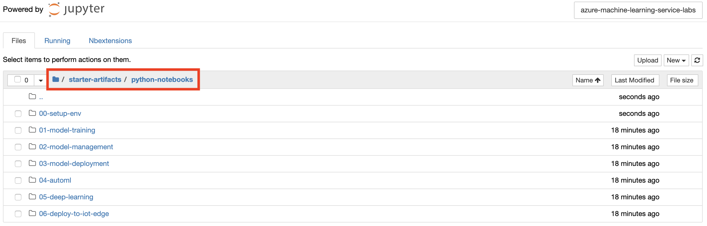
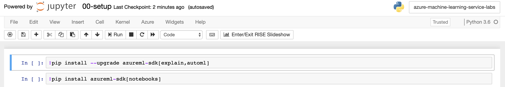

# Azure Notebooks Setup

At a high level, here are the setup steps you will need to perform to prepare your Azure Notebooks Environment (the detailed instructions follow):

1. Setup an Azure Notebooks account. 

2. Setup Azure Notebooks Project

3. Start the Notebook Server

4. Locate your lab files

5. Update your Notebook Environment 

## Setup an Azure Notebooks account
1. In your browser, navigate to https://notebooks.azure.com/.

2. Select Sign In from the top, right corner and sign in using your Microsoft Account credentials. After a successful login, you will have implicitly created the account and are ready to continue.

## Setup Azure Notebooks Project

1. Log in to [Azure Notebooks](https://notebooks.azure.com/).

2. Navigate to **My Projects** page

3. Select **Upload GitHub Repo**.

4. In the Upload GitHub Repository dialog, for the GitHub repository provide `https://github.com/solliancenet/azure-machine-learning-service-labs.git`, and select **Import**. Allow the import a few moments to complete, the dialog will dismiss once the import has completed.

## Start the Notebook Server

1. Navigate to your project: `azure-machine-learning-service-labs`

2. Start your Notebook server on `Free Compute` by clicking on the **Play** icon in the toolbar as shown:

	

3. It should open **Jupyter Notebooks** interface.

	

## Locate your lab files 

1.  Navigate to the `>starter-artifacts->python-notebooks` folder where you will find all your lab files.

	

## Update your Notebook Environment 

1. Open notebook: **00-setup-env/00-setup.ipynb**

2. Run each cell in the notebook to install the required libraries.

	
